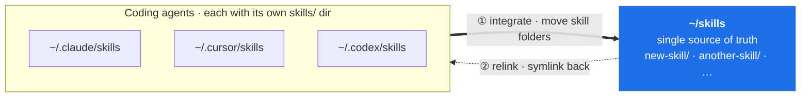

# sync-agent-skills

Keep your user-authored **global skills** in one place and share them across
multiple agent CLIs — [Claude Code](https://docs.claude.com/en/docs/claude-code),
[Codex](https://github.com/openai/codex), and [Cursor](https://cursor.com).

Author a skill once in any agent; it becomes available in all of them via a
shared directory and symlinks. No copying, no drift.

**This is an agent-invoked skill, not a CLI tool.** Its user is the agent. Once
installed, whenever an agent creates, renames, moves, or deletes a skill it runs
the sync itself as the last step (see `SKILL.md` for the exact triggers). You do
not run it as part of normal use — there is no day-to-day human command.

## How it works

One shared directory (`~/skills`, override with `$SKILLS_SHARED_DIR`) holds the
real skill folders. Each agent's skills directory gets **symlinks** back into it:

```
~/skills/                         # source of truth
  sync-agent-skills/
  merge-ai-texts/
  ...

~/.claude/skills/sync-agent-skills -> ~/skills/sync-agent-skills
~/.cursor/skills/sync-agent-skills -> ~/skills/sync-agent-skills
~/.codex/skills/sync-agent-skills  -> ~/skills/sync-agent-skills
```

## Setup (one-time, by hand)

There is a bootstrap chicken-and-egg: until this skill is symlinked into the
agents, no agent can see or invoke it. So the **first** link-in is the one thing
you do manually (or hand to an agent once):

```bash
git clone https://github.com/chrisyucode/sync-agent-skills.git ~/skills/sync-agent-skills
chmod +x ~/skills/sync-agent-skills/sync-skills.sh
~/skills/sync-agent-skills/sync-skills.sh   # links it into every installed agent
```

After this, you're done. The agents take over.

## Who runs it after setup

The **agent** does — automatically, with no command from you. When an agent
creates / renames / moves / deletes a skill, it runs `sync-skills.sh` as its
final step so the change propagates everywhere. See `SKILL.md` for the triggers.

## What the sync does

Real skill folders scattered across each agent are **moved into one shared dir**,
then **symlinked back** to every agent — so there's a single source of truth and
no copies drift apart:



Thick arrows = the one-time move into the shared dir; dotted arrows = the
symlinks pointing back. Each run does three things, so you can reason about its
output:

1. **integrate** — for each agent's `skills/` dir, move any *new real*
   (non-symlink) skill folder containing a `SKILL.md` into the shared dir, then
   replace it with a symlink. Tool-bundled skills are left untouched
   (`anthropics/`, Codex `.system/`, Cursor's separate `skills-cursor/`), as are
   existing symlinks (e.g. project links) and non-directories (e.g. zip files).
2. **relink** — symlink every shared skill into every installed agent; repair
   wrong targets.
3. **prune** — remove dangling symlinks that pointed into the shared dir.

It is idempotent — re-running changes nothing if everything is already in sync.

## Configuration

Edit the top of `sync-skills.sh`:

| Variable | Purpose |
|---|---|
| `TOOLS` | The per-agent `skills/` directories to manage. |
| `EXCLUDE` | Top-level names never absorbed into the shared dir. |
| `update_agents()` | The CLI update commands used by `--update` (best-effort; adjust to your install method). |

## License

MIT
